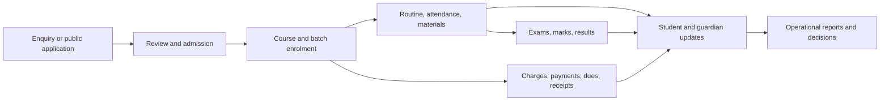
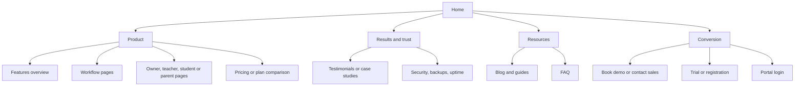

# Coaching Management Service Research

**Research date:** 12 July 2026  
**Scope:** Coaching-centre management products, with emphasis on Bangladesh and comparable South Asian SaaS products.  
**Purpose:** Identify what these services sell, how their services are structured, how their public websites are organized, and what page architecture best fits Dhrubok Portal.

## Executive summary

Coaching-management products do not primarily sell a collection of isolated features. They sell one connected operating system built around the student lifecycle:



The strongest service structures have five layers:

1. **Acquire:** enquiry capture, public admission, lead follow-up, and conversion.
2. **Operate:** students, teachers, courses, batches, routines, and attendance.
3. **Collect:** fee plans, instalments, payments, dues, reminders, and receipts.
4. **Teach and assess:** materials, assignments, exams, marks, results, and merit reports.
5. **Communicate and control:** portals, SMS/WhatsApp, reports, permissions, audit history, support, and data export.

Dhrubok already covers most of the high-value single-centre core. Its clearest differentiation should be: **built for one Bangladeshi coaching centre, bilingual, fast for everyday desk work, guardian communication without requiring guardian accounts, and trustworthy records for attendance, payments, and published results.**

## Comparable services

### 1. CampusQ — Bangladesh-focused coaching SaaS

CampusQ presents three role-specific portals: admin, teacher, and student. Its modules include students, teachers, courses and batches, attendance, exams and results, payments, reports, study materials, announcements, and role-based access. It localizes the finance message with cash, bKash, and Nagad tracking.

Its service is structured around role outcomes:

- Admin: revenue, dues, slips, and monthly reports.
- Teacher: session attendance and attendance history.
- Student: attendance, exams, results, payment history, materials, and announcements.

Public website structure: Home → Features → Pricing → Blog → About → Contact → Sign up. The homepage itself moves from product promise to dashboard proof, feature overview, role-based benefits, trust/security, testimonials, trial CTA, and educational content.

### 2. Smart Academic System — Bangladesh education ERP

Smart Academic System serves schools, colleges, madrasas, and coaching centres. It emphasizes student information, attendance, results, fees, SMS notifications, dashboards, mobile apps, security, training, and support.

Its commercial service is more implementation-led than self-service SaaS:

- One-time setup fee.
- Annual subscription based on student count.
- Optional modules and mobile-app licensing.
- Demo booking, staff training, WhatsApp/phone support, and a dedicated account manager.

Public website structure: Home → Key Features → Institutions Served → Mobile App → Free Website Design → Demo/Contact, supported by FAQ, privacy, terms, and sitemap pages.

### 3. Classpro — established coaching operations platform

Classpro groups its value around fee management, biometric attendance, student performance, student/parent app, reports, homework, materials, notifications, and enquiry/lead management. Its homepage sells operational efficiency first, then feature proof, customer scale and testimonials, pricing, support, and free-trial conversion.

The service structure combines software with an admin app, support desk, onboarding/sales contact, free resources, and recurring plans. It positions fee visibility, parent communication, and reduced administrative work as the main outcomes.

Public website structure: Home → Features/use-case detail → Plans & Pricing → User Stories → Company/Team/Careers → FAQ/Blog/Resources → Support/Contact → Trial.

### 4. ClassNivo — module- and tier-based SaaS

ClassNivo exposes the clearest commercial packaging. Its workflow is enquiry → branch → admission → batch/teacher → fees → expenses/P&L → attendance/exams/assignments → reports. Plans scale mainly by student count, branch count, integrations, advanced reports, and support level.

Core module groups:

- Student lifecycle.
- Fees, expenses, and profit/loss.
- Attendance and exams.
- Communication.
- Academic operations.
- Branches and dashboards.

Public website structure: Home → Features → Plans → FAQ → Upcoming → Contact → Trial. Supporting workflow landing pages cover branches, students, fees, expenses, exams, and admissions.

### 5. ClassTotal — feature-depth and self-service model

ClassTotal organizes features by user job: admissions/inquiries, attendance, fees, exams, reports/dashboard, student portal/website, notifications, and platform productivity. It adds mature operational details such as global student search, role permissions, record activity logs, exports, mobile navigation, customizable dashboards, and guided onboarding.

Its service structure combines a free entry plan with higher tiers that unlock risk analysis, automation, richer reporting, and productivity capabilities.

Public website structure: Home → Features → Pricing → solution/use-case pages → About → Contact → Login/Sign-up. The feature page is a deep, grouped catalogue rather than a flat icon wall.

## Market service taxonomy

| Service domain | Typical capabilities | Primary user | Business outcome |
|---|---|---|---|
| Enquiries and admission | Lead capture, application, review, document collection, conversion | Owner/front desk | More enrolments, less duplicate entry |
| Student lifecycle | Profile, guardian, course/batch enrolment, status/history | Owner/admin | One reliable student record |
| Academic setup | Sessions, subjects, courses, batches, teachers, assignments | Owner | Reusable operating structure |
| Scheduling | Weekly routines, rooms, teacher/batch conflicts | Owner/teacher/student | Fewer timetable mistakes |
| Attendance | Session roster, present/late/absent, analytics, alerts | Teacher/owner | Faster capture and early intervention |
| Fees | Fee plans, charges, discounts, instalments, payments, dues | Owner/front desk | Better collection and auditability |
| Receipts and accounting | Printable receipts, payment history, exports, expense/P&L | Owner | Financial proof and oversight |
| Exams and results | Exam setup, subjects/components, marks, grades, merit, report cards | Teacher/owner/student | Faster, consistent result publication |
| Learning content | Materials, homework/assignments, notices | Teacher/student | Learning continuity outside class |
| Communication | SMS, WhatsApp, push, templates, delivery logs | Owner/teacher/family | Fewer calls and missed updates |
| Self-service portals | Student, teacher, and sometimes guardian apps/portals | All roles | Less front-desk workload |
| Reporting and control | Dashboards, exports, permissions, audit logs | Owner | Better decisions and accountability |
| Platform service | Setup, migration, training, support, backup, security | Owner | Lower adoption and operational risk |

## How vendors package the service

The market uses four common packaging axes:

1. **Institute size:** student-count limits are the simplest and most common tier boundary.
2. **Operational complexity:** single branch versus multi-branch, basic versus advanced reporting, and limited versus granular permissions.
3. **Communication/integrations:** included SMS volume, bring-your-own gateway, WhatsApp, payment gateways, biometrics, and mobile apps.
4. **Service level:** self-service/email support, onboarding, priority support, dedicated manager, custom deployment, and data migration.

For Dhrubok, this is an internal product for one centre rather than a generic multi-tenant SaaS. It should therefore structure navigation around daily work, not around pricing-plan entitlements. Service administration should still explicitly cover onboarding/import, role linking, SMS configuration and delivery logs, backups/export, and operational support.

## Common public website architecture



### Typical homepage section order

1. Header: product navigation, login, and one primary conversion CTA.
2. Hero: target user + operational promise + product screenshot.
3. Trust strip: institute/customer count, testimonials, or recognizable customers.
4. Problem-to-outcome section: spreadsheets, fee leakage, attendance delay, and parent calls.
5. Feature/module overview grouped by workflow.
6. Role-specific value for owner/admin, teacher, student, and optionally parent.
7. Connected lifecycle/workflow demonstration.
8. Reporting, communication, security, backup, and support proof.
9. Pricing/demo/trial CTA.
10. FAQ, resources, and full legal/company footer.

### Important distinction

The **public marketing site** answers “Why should I trust or choose this service?” The **authenticated portal** answers “What do I need to do now?” Mixing these produces bloated navigation. Marketing pages should explain outcomes and proof; portal pages should be short, task-oriented, and role-limited.

## Dhrubok's current page architecture

### Public website

```text
/{locale}
├── /courses
│   └── /[slug]
├── /teachers
├── /notices
│   └── /[noticeId]
├── /about
├── /contact
├── /admission
├── /sign-in/[[...sign-in]]
├── /access
└── /access-pending
```

This is appropriate for a single coaching centre's public website. Unlike SaaS vendors, Dhrubok does not need product pricing, trial, integration, or feature-catalogue pages. Its public visitors are prospective students and families, so courses, teachers, notices, centre trust, contact, and admission are the correct top-level destinations.

### Owner portal

```text
/{locale}/owner
├── /students
├── /admissions
├── /courses
├── /attendance
├── /finance
├── /exams
├── /materials
├── /notices
├── /messages
├── /reports
├── /website
├── /settings
├── /receipt/[paymentId]
└── /reports
    ├── /attendance/[batchId]
    ├── /students/[studentId]/statement
    └── /exams/[examId]
        ├── /result-sheet
        ├── /merit-list
        └── /students/[studentId]
```

### Teacher portal

```text
/{locale}/teacher
├── /batches
├── /routine
├── /attendance
├── /exams
├── /materials
├── /notices
├── /profile
└── /reports
    ├── /attendance/[batchId]
    └── /exams/[examId]/result-sheet
```

### Student portal

```text
/{locale}/student
├── /routine
├── /attendance
├── /fees
├── /results
├── /materials
├── /notices
├── /profile
├── /receipt/[paymentId]
└── /results/[examId]/print
```

## Recommended Dhrubok information architecture

Keep the existing routes and workflows. Improve their conceptual grouping in navigation and documentation rather than replacing them.

### Public navigation

- **Primary:** Home, Courses, Teachers, Notices, About, Contact.
- **Utility/actions:** বাংলা/English, Sign in, Apply for admission.
- **Course detail:** overview, subjects/outcomes, schedule or batch availability, fee/admission guidance, teacher(s), and apply CTA.
- **Admission:** short process explainer → application form → submission confirmation/status guidance.

### Owner navigation groups

- **Overview:** Dashboard.
- **People and enrolment:** Admissions, Students.
- **Academic operations:** Courses & batches, Attendance, Exams, Materials, Notices.
- **Money:** Finance, Receipts/statements through student/payment context.
- **Communication:** Messages and SMS delivery/logs.
- **Insights:** Reports.
- **Centre administration:** Public website, Settings.

### Teacher navigation groups

- **Today:** Dashboard, Routine.
- **Teaching:** Batches, Attendance, Exams/marks.
- **Publish:** Materials, Notices.
- **Account:** Profile.

### Student navigation groups

- **Today:** Dashboard, Routine, Notices.
- **Progress:** Attendance, Results.
- **Resources:** Materials.
- **Account:** Fees/receipts, Profile.

## Gap analysis and priorities

### Keep as Dhrubok strengths

- Public application and separate owner direct-admission paths.
- Google/Clerk identity linked only to approved centre records.
- Exactly three attendance states and immutable submission.
- Automatic guardian SMS for late/absent attendance, payments, and published results.
- Manual fee collection with printable receipts and owner-controlled due reminders.
- Offline, multi-subject exams with owner publication and merit position.
- Bangla and English across public content, portals, SMS, and print outputs.
- No guardian account requirement, which reduces onboarding friction for this centre.

### Near-term improvements supported by market evidence

1. **Global student search:** name, student number, phone, guardian phone, course, and batch, with quick actions for payment, statement, profile, and enrolment.
2. **Lifecycle views:** show application/admission/enrolment history and a student 360 view instead of making staff reconstruct it across modules.
3. **Operational dashboard:** today's classes, attendance waiting for submission, fees collected, overdue count, pending admissions, marks waiting, and failed SMS.
4. **Communication reliability:** searchable delivery logs, retry/diagnostic status, template previews, recipient counts, and provider balance/health.
5. **Exports and auditability:** CSV/PDF exports plus visible created-by/published-by/recorded-by metadata for high-trust records.
6. **Onboarding and data import:** documented CSV import, validation, duplicate detection, and first-owner setup.

### Avoid unless scope changes

- Multi-branch tenancy and branch-level profit/loss.
- Online payment gateway and automated card/mobile-wallet settlement.
- Guardian accounts or a separate parent app.
- Biometric hardware.
- Generic CRM/marketing automation.
- AI question generation or AI analytics before core operational data is complete and trustworthy.

## Recommended public-page content model

Because Dhrubok is the coaching centre itself—not a company selling coaching software—the public site should borrow competitors' persuasive structure but change the subject from “our software” to “our coaching service.”

| Page | Visitor question | Essential sections |
|---|---|---|
| Home | Why Dhrubok? | Promise, current courses, teaching approach, teachers, proof, notices, admission CTA |
| Courses | What can I join? | Search/filter, active courses, audience/class level, subject coverage, batch status |
| Course detail | Is this course right for me? | Outcomes, subjects, teachers, schedule/batches, fee guidance, admission steps |
| Teachers | Who will teach me? | Credentials, subjects, course/batch association, teaching approach |
| Notices | What is happening now? | Published notices, dates, audience, detail pages |
| About | Can I trust this centre? | Story, principles, teaching model, facilities/proof, owner/centre identity |
| Contact | How do I reach or visit? | Phone, address/map, hours, directions, message path |
| Admission | How do I apply? | Eligibility/process, course and batch preference, applicant/guardian details, consent, confirmation |
| Sign in | Where is my portal? | Google sign-in, role-linking explanation, access-pending help |

## Sources

- [CampusQ homepage](https://campusqbd.com/)
- [Smart Academic System](https://www.schoolsoftware-bd.com/)
- [Classpro homepage](https://www.classpro.in/)
- [ClassNivo homepage and plans](https://classnivo.com/)
- [ClassTotal feature catalogue](https://classtotal.com/features)
- [CIMS Institute Management Software](https://www.institutemanagementsoftware.com/index.html)
- [MiniSchool Bangladesh](https://school.minisoft.bd/)
- [ShikkhaPlus](https://www.shikkhaplus.com/)

## Evidence caveat

This document records publicly visible vendor claims and information architecture observed on 12 July 2026. Claims such as customer counts, uptime, security posture, and operational outcomes were not independently audited. Competitor authenticated dashboards were not accessed except where prior authorized workspace research had already documented visible Penless modules; page trees for private products should therefore be treated as a service-model synthesis, not a reverse-engineered internal route map.
