# Penless Education Module Blueprint

Source inspected: logged-in Penless Education dashboard for **Dhrubok Education Family**.

This document describes only the features requested for a clone:

- Student Admission
- Attendance
- Tuition Fee Collection
- Exam and Result
- Notice and SMS

## 1. Product Shape

Penless is organized as an admin dashboard. The requested features are not isolated pages; they share the same core records: students, guardians, batches, courses, fees, exams, marks, and notifications.

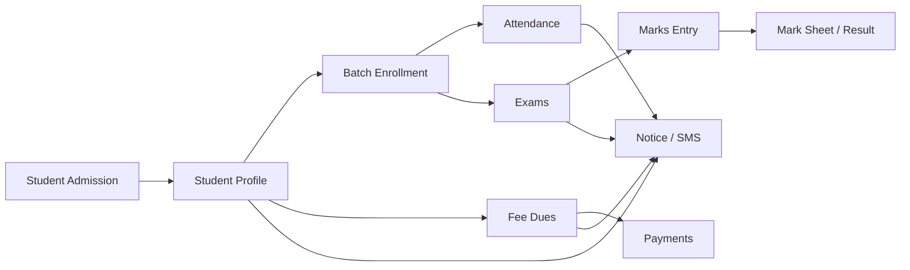

## 2. Dashboard Navigation

| Area | Relevant Penless menus | Purpose |
| --- | --- | --- |
| Academic | `Students`, `Admissions`, `Attendance`, `Batches`, `Courses` | Student records, admission, enrollment, attendance |
| Finance | `Collect Fee`, `Due List`, `Reports` | Fee due generation, payment collection, finance summary |
| Exams | `Exams`, `Marks Entry`, `Mark Sheet` | Exam setup, marks entry, result generation |
| Communication | `Announcements`, `Broadcast`, `Notification Logs`, `Notification Prefs` | Notice publishing, SMS/WhatsApp/Email, delivery tracking |

## 3. Student Admission

### What It Does

The admission module accepts new student information, guardian details, course/batch enrollment, initial fee setup, and account creation settings. It can either create the student immediately or save the record as a pending admission request.

### Page Overview

| UI area | Observed behavior |
| --- | --- |
| Summary cards | Shows counts for `Pending`, `Approved`, `Converted`, `Rejected` |
| Filters | `All Requests`, `Pending`, `Approved`, `Rejected`, `Converted` |
| Search | Search admission requests |
| Main action | `New Admission` |
| Table columns | `Applicant`, `Contact`, `School/Class`, `Course`, `Applied`, `Payment`, `Status`, `Actions` |

### Admission Flow

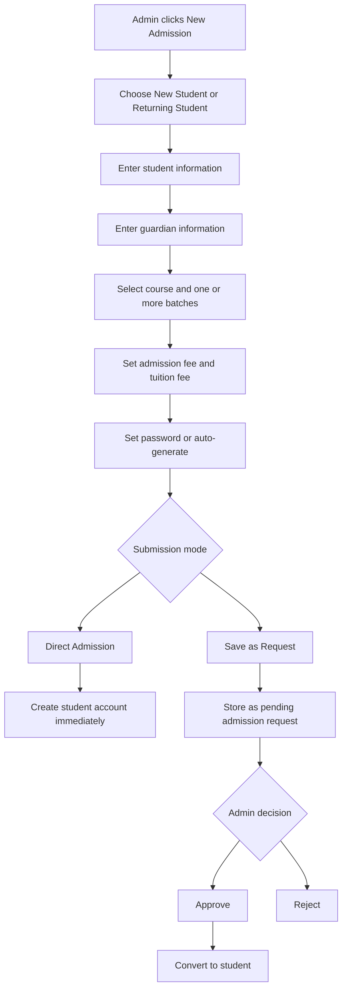

### New Admission Form

| Section | Fields |
| --- | --- |
| Student type | New Student, Returning Student |
| Student ID | Auto, Manual, Hybrid |
| Student info | Student Name, Phone Number, Email, Date of Birth, Class / Grade, School / College, Class Roll, Blood Group, Address, Photo |
| Guardian info | Father's Name, Father's Phone, Mother's Name, Mother's Phone, Guardian Email |
| Enrollment | Course, Batches |
| Payment | Fee Type, Admission Fee, Monthly Tuition Fee, Admission Date, Referred By |
| Account | Password, Notes / Remarks |
| Submission | Direct Admission, Save as Request |

### Status Model

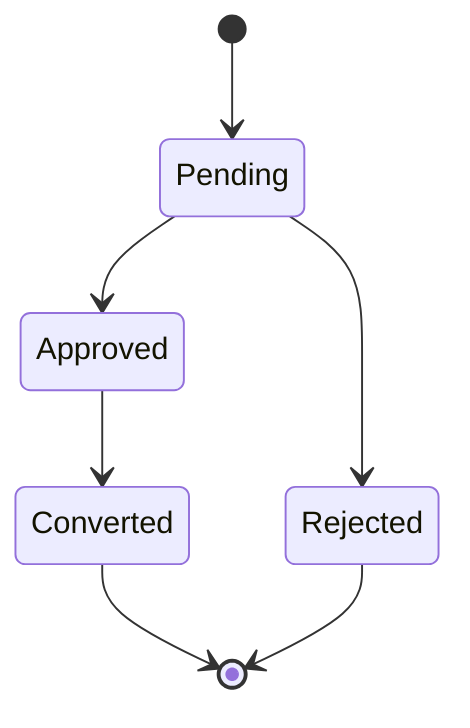

## 4. Attendance

### What It Does

Attendance is recorded by batch and date. The admin loads a batch roster, sets a status for each student, optionally writes notes, then saves the attendance sheet.

### Page Overview

| UI area | Observed behavior |
| --- | --- |
| Modes | `Student Attendance`, `Teacher Attendance`, `Dropout Risk Analysis`, `Notifications` |
| Inputs | Batch selector, date selector |
| Main action | `Load Attendance` |
| Loaded summary | Present count, Absent count, Late count, Excused count |
| Loaded actions | `Notify Guardians`, `Save Attendance` |
| Table columns | `Student`, `Status`, `Notes` |

### Attendance Flow

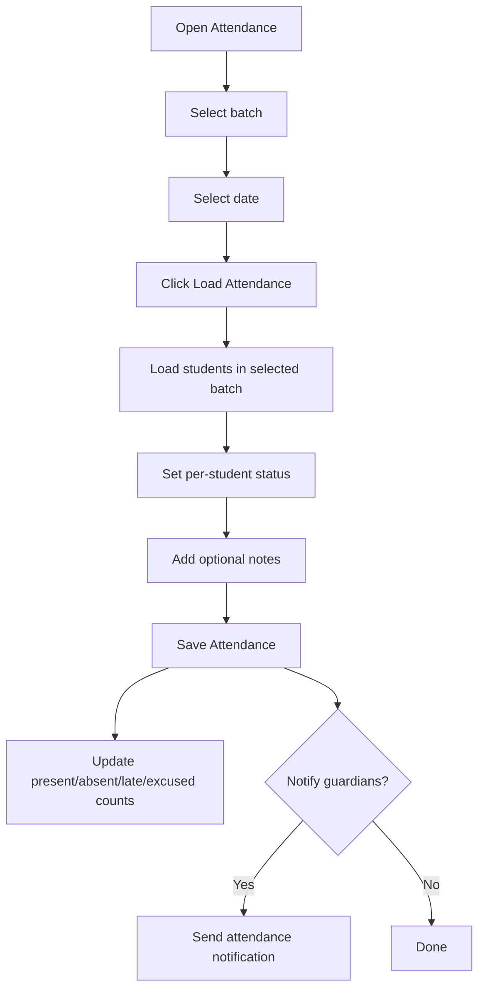

### Attendance Statuses

| Status | Meaning |
| --- | --- |
| Present | Student attended |
| Absent | Student did not attend |
| Late | Student attended late |
| Excused | Absence/late status is excused |

## 5. Tuition Fee Collection

### What It Does

The finance workflow has two separate record types:

- Fee dues: what a student owes.
- Payments: what a student has paid.

### Finance Overview

| Metric | Purpose |
| --- | --- |
| Collected This Month | Total received in the current month |
| Pending | Amount still pending |
| Overdue | Amount past due date |
| Collection Rate | Percentage collected |
| Total Expenses | Expense total shown beside finance summary |
| Outstanding Dues | Total unpaid dues |
| Net Income | Payment income minus expenses |

### Fee Collection Flow

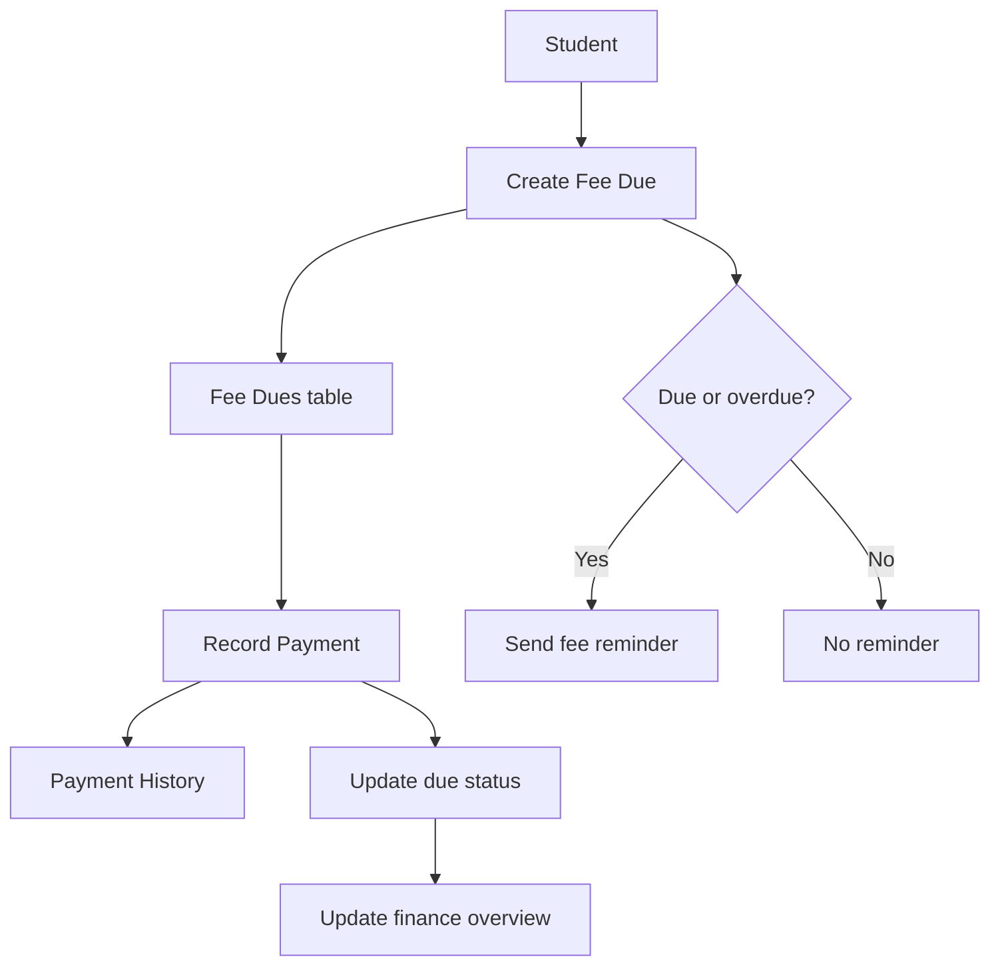

### Fee Dues Tab

| UI area | Observed behavior |
| --- | --- |
| Main actions | `Generate Monthly Dues`, `Add Fee Due` |
| Table columns | `Student`, `Description`, `Amount`, `Due Date`, `Status`, `Actions` |
| Add Fee Due fields | Student, Amount, Due Date, Description |

### Payment History Tab

| UI area | Observed behavior |
| --- | --- |
| Main action | `Add Payment` |
| Table columns | `Student`, `Amount`, `Method`, `Date`, `Notes`, `Status`, `Actions` |
| Add Payment fields | Student, Amount, Payment Method, Transaction ID, Notes |
| Payment methods | Cash, Bank Transfer, UPI, Cheque, Other |

## 6. Exam And Result

### What It Does

The exam workflow has three stages:

1. Create/manage exams.
2. Enter marks.
3. Generate mark sheets/results.

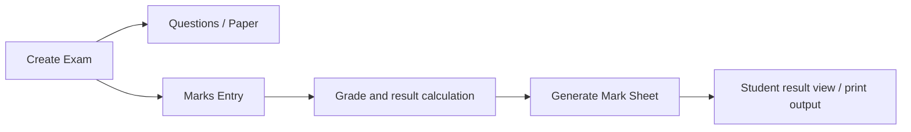

### Exams Page

| UI area | Observed behavior |
| --- | --- |
| Filters | Approval status, batch, class, upcoming/complete |
| Main actions | `AI Generate Questions`, `Create Exam` |
| Table columns | `Name`, `Type`, `Subject`, `Topic`, `Batch`, `Date`, `Status`, `Approval`, `Actions` |
| Row actions | Questions, Paper, Edit, Publish/Unpublish |

### Create Exam Form

| Field group | Fields |
| --- | --- |
| Identity | Exam Name, Batch, Subject, Topic, Class |
| Exam type | MCQ, Written, Practical, Viva |
| Marks | Total Marks, Pass Marks |
| Schedule | Date, Duration |
| Details | Instructions |

### Marks Entry Flow

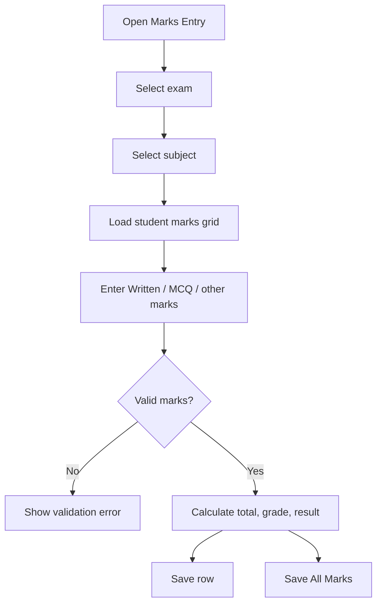

### Marks Entry Table

| Column | Purpose |
| --- | --- |
| Student Name | Student identity |
| Written | Written marks |
| MCQ | MCQ marks |
| Total Marks | Calculated or entered total |
| Max Marks | Maximum allowed marks |
| Grade | Calculated grade |
| Result | Pass/fail |
| Absent | Marks student absent |
| Remarks | Optional comment |
| Status | Saved/pending state |
| Action | Row-level save |

Validation observed:

- Marks cannot be negative.
- Marks cannot exceed total marks.
- Pass/fail is based on configured pass marks.

### Mark Sheet Flow

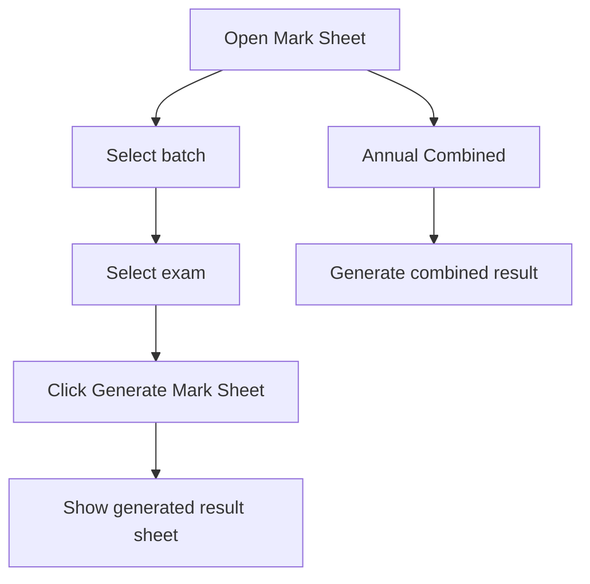

## 7. Notice And SMS

### What It Does

Penless separates notice publishing from bulk messaging:

- Announcements are notice posts.
- Broadcasts are bulk SMS/WhatsApp/Email campaigns.
- Notification Logs track delivery.
- Notification Preferences control who receives which categories.

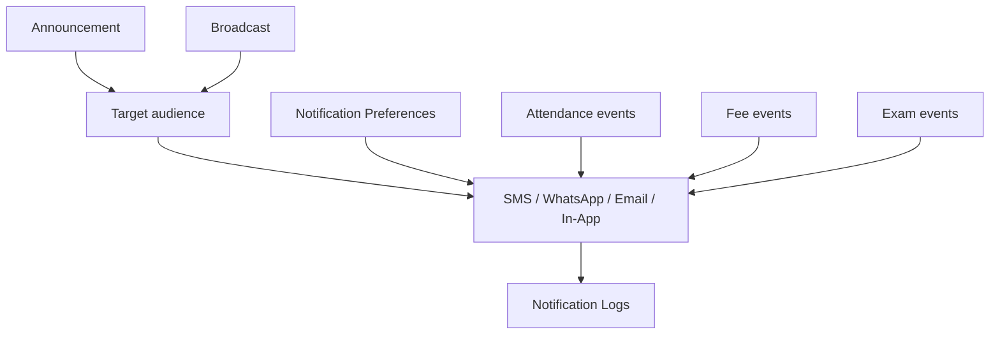

### Announcements

| UI area | Observed behavior |
| --- | --- |
| Main action | `New Announcement` |
| Table columns | `Title`, `Audience`, `Channels`, `Pinned`, `Expires`, `Created`, `Actions` |
| Form fields | Title, Content, Target Audience, Expiry Date, delivery channels, Pin this announcement |
| Audiences | Everyone, Students, Teachers, Parents, Employees |
| Optional channels | SMS, WhatsApp, Email |

### Broadcast

| UI area | Observed behavior |
| --- | --- |
| Summary cards | Total Broadcasts, Total Sent, Scheduled, Total Failed |
| Filters | Status, Type |
| Main actions | Templates, Create Broadcast |
| Table columns | `Type`, `Content`, `Recipients`, `Sent/Failed`, `Status`, `Date`, `Actions` |
| Statuses | Draft, Scheduled, Sent, Failed, Cancelled |

Create Broadcast fields:

| Field | Options / behavior |
| --- | --- |
| Channels | SMS, WhatsApp, Email |
| Recipients | All Students, All Parents, All Teachers, Specific Batch, lead groups, custom CSV/paste |
| Template | Optional saved template |
| Subject | Email subject |
| Schedule | Optional datetime |
| Message Content | Main message body |
| Make Recurring | Optional recurring broadcast |

### Notification Logs

| UI area | Observed behavior |
| --- | --- |
| Summary | Total Notifications, Sent, Failed, By Channel |
| Filters | From date, To date, Channel, Status |
| Channels | SMS, WhatsApp, Email, In-App |
| Statuses | Sent, Delivered, Failed, Pending |
| Table columns | `Student`, `Channel`, `Type`, `Status`, `Message`, `Date` |

### Notification Preferences

| Column | Purpose |
| --- | --- |
| Name | User name |
| Role | Student, parent, teacher, etc. |
| Phone | SMS/WhatsApp destination |
| Email | Email destination |
| SMS | Channel preference |
| WA | WhatsApp preference |
| Email | Email preference |
| In-App | In-app notification preference |
| Fees | Fee notification category |
| Attendance | Attendance notification category |
| Exams | Exam notification category |
| Status | Active/inactive state |

The UI says admins can click check/cross controls to toggle a user's notification preference.

## 8. Suggested Clone Data Model

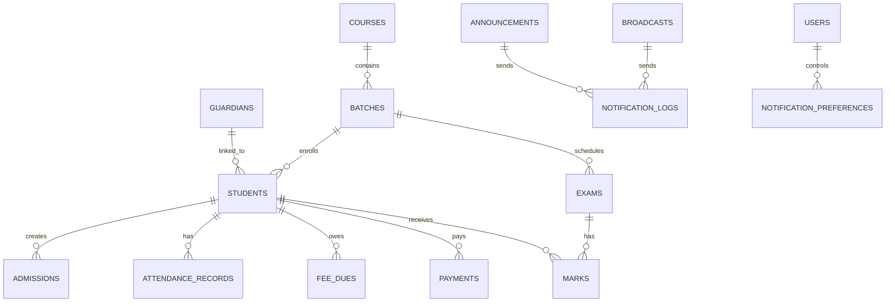

| Table / collection | Main responsibility |
| --- | --- |
| `students` | Student identity, class, school, contact, account status |
| `guardians` | Parent/guardian names, phone, email |
| `courses` | Academic/course grouping |
| `batches` | Batch name, course, teacher, capacity |
| `batch_enrollments` | Student-to-batch membership |
| `admissions` | Pending/direct admission form records |
| `attendance_records` | Per-student attendance by batch/date |
| `fee_dues` | Expected payments with due dates |
| `payments` | Collected payments |
| `exams` | Exam setup and schedule |
| `exam_subjects` | Optional subject-level exam structure |
| `marks` | Per-student marks, grade, result |
| `mark_sheets` | Generated result snapshots |
| `announcements` | Notice posts |
| `broadcasts` | Bulk message campaigns |
| `broadcast_recipients` | Resolved recipients for each broadcast |
| `notification_logs` | Delivery attempts and results |
| `notification_preferences` | Per-user channel/category settings |

## 9. MVP Build Order

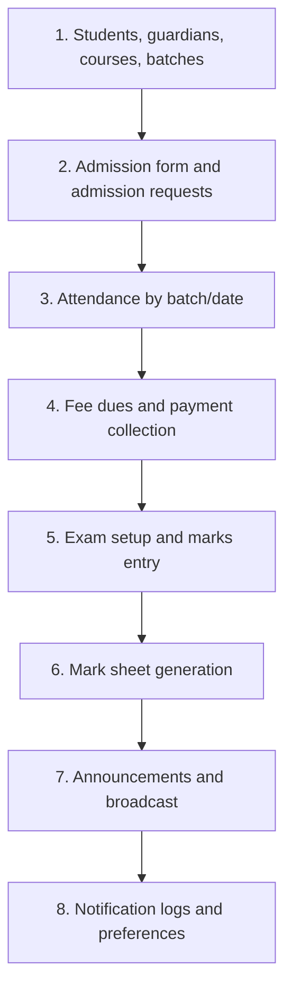

### Recommended First Version

| Phase | Build |
| --- | --- |
| 1 | Student, guardian, course, and batch records |
| 2 | Direct admission plus pending admission request |
| 3 | Batch attendance with status and notes |
| 4 | Fee due creation plus payment recording |
| 5 | Exam creation, marks entry, grade/pass-fail calculation |
| 6 | Mark sheet generation |
| 7 | Announcements and simple SMS/broadcast logs |

## 10. What Not To Clone Yet

Avoid these until the five requested workflows are stable:

- ID cards
- Payroll
- Expenses
- Wallet
- Coupons
- Leads and scoring board
- Live classes
- Videos
- Support tickets
- AI question generation

Those features are visible in Penless, but they are outside the requested scope and will slow down the first usable version.
